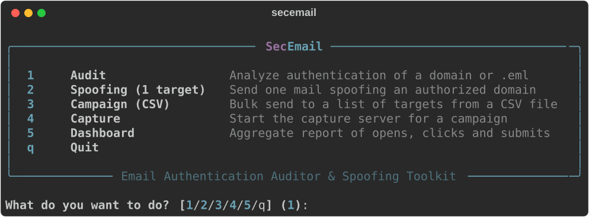
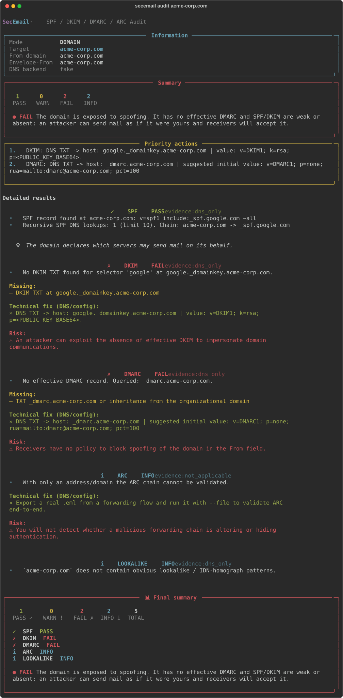
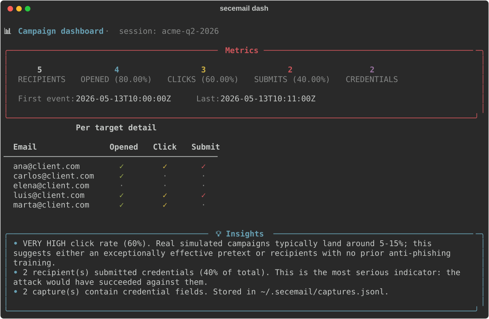

# SecEmail

A small, opinionated toolkit for email authentication audits and authorized phishing simulations. Born out of pain working real Red Team engagements where existing tools either gave you green checkmarks that lied or buried the actual problem under hundreds of lines of jargon.

It does three things well:

1. Audits SPF, DKIM, DMARC and ARC for a domain or a `.eml`, verifies signatures cryptographically, and tells you what is broken in one sentence.
2. Sends spoofed emails over SMTP for authorized engagements, with optional tracking, a capture server for credentials, and per campaign reporting.
3. Keeps a forensic log of everything you do, so months later you can still answer "what did I send, when, and why".

Everything is in English. Everything runs offline against your own DNS. You get a guided menu by default so you don't need to memorize twenty flags.

## What it looks like

The interactive menu when you run `secemail` with no arguments:



An audit of a domain that has SPF set up but no DMARC and a missing DKIM selector:



The campaign dashboard after a few people clicked and a couple of them entered credentials:



## Why use it instead of something else

There are plenty of tools that check SPF and DMARC. Most of them tell you what is published and stop there. SecEmail is built so you can answer the next question, which is usually "ok, what now?":

- When a DKIM signature fails it tells you whether it failed because the key is missing, because the algorithm is `rsa-sha1`, because of the `l=` length tag, or because the body was modified after signing.
- When an SMTP send bounces with `550 5.7.1 ... blocked using Spamhaus` it does not just print the raw error. It says "your IP is on an anti-spam blocklist. Use an authenticated relay like Mailgun, SendGrid, SES or Postmark".
- When DMARC alignment fails, the verdict is one sentence in plain English at the top and at the bottom of the report. No need to scroll.
- The dashboard tells you "60% click rate is very high, normal range is 5 to 15 percent", so a junior on the team can interpret the numbers without asking a senior.

It is intentionally small. Roughly 5,000 lines of Python, 12 source files, 167 tests. No telemetry, no cloud account, no daemon.

## What it audits

* **SPF**: records, duplicates, `+all`, recursive lookup count against the RFC 7208 limit, dangerous macros, `redirect=`.
* **DKIM**: selector and key in DNS plus cryptographic verification on the `.eml`. Flags `l=`, `rsa-sha1`, `t=y`, weird `k=` values and keys under 1024 bits.
* **DMARC**: organizational domain fallback via PSL, effective `p` and `sp`, real alignment with the verified DKIM `d=` and the envelope `MAIL FROM`, external `rua` reporter authorization.
* **ARC**: chain integrity and `cv=fail` detection.
* **Authentication-Results**: explicit trust boundary with `--trusted-authserv-id`, defense against post-MTA header injection (RFC 8601 §5).
* **Modern checks**: MTA-STS (with TXT and HTTPS policy fetch), TLS-RPT, DANE per MX, BIMI.
* **Lookalike / IDN homograph**: catches `paypaI.com` (capital I), `rnicrosoft.com`, `g00gle.com`, mixed Cyrillic and Greek, and punycode.

The JSON output has a stable `schema_version` so you can pipe it into Splunk or Elastic without surprises between releases.

## How campaigns work

This was confusing in earlier versions, so let me be explicit.

Every send carries a `campaign-name`. If you don't pass one, SecEmail generates a readable default like `acme.com-20260513-1842` (target domain plus UTC timestamp). The wizard offers you a suggestion and lets you override it.

All sends that share the same `--campaign-name` show up grouped in the dashboard. So if you send three emails as separate commands but with `--campaign-name "phish-acme-2026Q2"`, they appear as one campaign with three recipients.

To see what campaigns you have stored:

```bash
secemail dash --list
```

To open one specific campaign:

```bash
secemail dash --session-id phish-acme-2026Q2
```

Three files in `~/.secemail/` keep state. They are JSONL, append only, easy to inspect with `jq`:

* `audit.jsonl`: one line per send with UTC timestamp, operator, MX, SMTP code, SHA-256 of the `.eml`.
* `tracking.jsonl`: token to target mapping for every campaign.
* `captures.jsonl`: events from the capture server, opens, clicks, submits, and the actual POST bodies.

Set `SECEMAIL_AUDIT_LOG=/some/path.jsonl` if you want to route the forensic log elsewhere.

## OPSEC and authorization

The tool assumes you have written contractual authorization to send mail spoofing the domains you specify. There is no DRM, no nag screen, no UUID handshake. The forensic log is what makes you accountable, not a checkbox.

What it does for you operationally:

* `Date` header in UTC so your timezone does not leak.
* Forensic headers (`X-SecEmail-*`) off by default so a SOC cannot whitelist them and skew your measurement of their defenses. Use `--add-forensic-headers` if you want them in.
* Optional defensive allowlist with `--auth DOMAIN`. It warns if your target or From sit outside the list. It does not block. It is there to catch typos.
* Rate limit and recipient cap by default (`--max-recipients 50`, `--rate-per-minute 30`).
* The capture server binds to `127.0.0.1` by default. Put it behind Cloudflare Tunnel or nginx with TLS if you need it reachable from outside.

The license restricts use to authorized engagements, defensive analysis and academic training.

## Phishing templates

Seven HTML templates ship with the tool, all parameterizable, no real brands, no external assets that would leak forensic fingerprints:

| File | Pretext |
|---|---|
| `mfa_authenticator_approval.html` | Approve sign-in with a matching number |
| `documento_compartido.html` | Document shared by a colleague |
| `solicitud_firma_digital.html` | E-signature pending with countdown |
| `buzon_de_voz.html` | New voice message |
| `revision_compensacion_rrhh.html` | Annual compensation review |
| `quishing_paquete_aduana.html` | Customs package on hold with payment QR |
| `landing_portal_corporativo.html` | Corporate login (the page the CTAs link to) |

Placeholders like `{{TARGET_EMAIL}}`, `{{COMPANY_NAME}}`, `{{LURE_URL}}`, `{{PIXEL_URL}}` are filled at send time when you pass `--track --capture-url`.

The full list of placeholders and what each template is for is in `phishing_templates/README.md`.

## Installation

You need Python 3.10 or newer. If you don't have it:

```bash
# macOS
brew install python@3.12

# Ubuntu or Debian
sudo apt install python3.12 python3.12-venv

# Fedora
sudo dnf install python3.12
```

Then clone and run the installer:

```bash
git clone https://github.com/i12gocaj/SecEmail.git
cd SecEmail
./install.sh
```

That's it. The installer detects your Python version, creates a local virtual environment in `.venv/`, installs SecEmail and the dependencies, and verifies that `secemail --version` works.

To use the tool, activate the environment once per shell:

```bash
source .venv/bin/activate
secemail
```

If you prefer a system wide install:

```bash
./install.sh --global
```

Either way, the interactive menu launches when you type `secemail` with no arguments.

## Direct commands if you don't want the menu

```bash
# Audit a domain or a .eml file
secemail audit company.com
secemail audit company.com --full        # adds MTA-STS, TLS-RPT, DANE, BIMI
secemail audit ./mail.eml                # autodetect

# Send a spoofed email
secemail spoof victim@client.com --from ceo@client.com \
  --campaign-name "phish-acme-2026Q2" \
  --html phishing_templates/mfa_authenticator_approval.html \
  --track --capture-url https://lure.your-operator.tld

# Bulk send from a CSV file
secemail spoof --targets-file targets.csv --from ceo@client.com \
  --campaign-name "phish-acme-2026Q2-bulk" \
  --max-recipients 50 --rate-per-minute 30

# Capture server (the place victims land when they click)
secemail serve --port 8443 --templates-dir phishing_templates/

# Aggregate report
secemail dash --list                            # list campaigns
secemail dash --session-id phish-acme-2026Q2    # filter one
```

Add `--json` to any command to get machine readable output. `Ctrl+C` always exits cleanly without a traceback.

## Tests

```bash
pytest tests/ -v
```

The suite has 167 tests. It covers regression of every P0 bug we ever shipped, end to end cryptographic DKIM verification with a real RSA key pair, defense against `Authentication-Results` injection, six anonymized `.eml` fixtures that reproduce real adversarial scenarios (multi DKIM attack, CRLF mixed export, AR injection with same authserv_id, Sender fallback), and a JSON schema snapshot so the wire format does not drift accidentally.

## Repo layout

```
SecEmail/
├── install.sh                  All in one installer
├── README.md
├── LICENSE                     Restricted to authorized engagements
├── pyproject.toml
├── requirements.txt
├── secemail/                   Main package
│   ├── cli.py                  CLI entry point
│   ├── wizard.py               Interactive menu
│   ├── checks/                 SPF, DKIM, DMARC, ARC, modern, runner
│   ├── spoof.py                Authorized SMTP sender
│   ├── capture.py              HTTP capture server
│   ├── tracking.py             Token to target mapping and dashboard
│   ├── explain.py              Plain English translations
│   ├── ui_rich.py              Visual renderer with rich
│   └── ...
├── phishing_templates/         Parameterizable HTML templates
├── docs/screenshots/           Screenshots used by this README
└── tests/                      167 tests + fixtures and snapshots
```

## License

See [`LICENSE`](LICENSE). Use is restricted to authorized engagements, defensive analysis and academic training.
